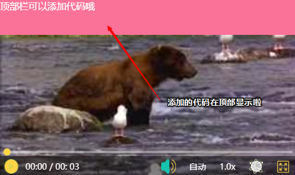

# 引言
Rel-ebb这个名字是经过三个单词拆分组合而成的，**Rel**的**re**表示**repel**，击退的意思，而**l**表示**low**，联合后面的**ebb**，译为低谷——人生的低谷，合起来就是击退人生的低谷，名字与项目本身并无一点关系，只是写这个项目时我正处于人生的低谷时期，还无力与现实斗争的我只能将情感寄托于我所热爱的编程，我记得宋濂在送东阳马生序中有这样一句话，叫做“以中有足乐者，不知口体之奉不若人也。盖余之勤且艰若此。”，人生如此，无法事事顺遂，但求精神追求能够丰富，以慰吾心。

# 介绍

我在做前端开发的时候，经常会使用到各种各样的前端ui库，一方面是美观，一方面是方便，节约时间。正是由于这些方面的原因，前端的ui库就如同天上繁星一般，数不胜数。因此，我认真的考虑过是否有必要再去造这个轮子，期间有过放弃，觉得没必要去花精力造，造出来可能还不如人家，不过最后经过一番挣扎还是决定去造这个轮子，原因有三，如下：

* 众多的ui库样式不一，人嘛，萝卜白菜各有所爱，于我来说，很难有一个前端ui库的所有样式都满足我的审美，所以我需要一款能够让所有样式都符合我的审美的产品，那这款产品最好就是我自己亲手定制
* 众多的ui库功能不一，在开发中可能需要使用到很多不同的功能，假设A功能只有ui库A拥有，B功能只有ui库B拥有，有一天我开发一个项目需要同时用到A跟B功能，就必须同时引入ui库A跟B，为了一个功能而引入几十上百余兆的一个ui库，我觉得并不划算，所以需要由我做一个整合
* 很多ui库只关注样式，很少关注功能，比方说我最近做的一个项目需要用到视频播放功能，就无法用ui库去实现，因此这个项目的定位不再是一个ui库，而是一个前端的工具集，希望能将平时前端开发中比较常用的一些功能进行整合

# 轮播图

## swiper

轮播图，可以放入swiper-item标签

|        属性        |  类型  |        默认值         | 是否必须 |          说明          |
| :----------------: | :----: | :-------------------: | :------: | :--------------------: |
|    point-panel     |  null  |          无           |    否    | 是否显示底部小圆点面板 |
| point-panel-color  | string | rgba(255,255,255,0.3) |    否    |  底部小圆点面板的颜色  |
|    point-color     | string |         #fff          |    否    |     底部小圆点颜色     |
| point-active-color | string |         #f00          |    否    |  底部小圆点激活的颜色  |
|      autoplay      |  null  |          无           |    否    |      是否自动轮播      |

## swiper-item

放置在swiper标签中，为每一项轮播页占位

| 属性  |  类型  | 默认值 | 是否必须 |       说明       |
| :---: | :----: | :----: | :------: | :--------------: |
| image | string |   ""   |    是    | 轮播图展示的图片 |
| link  | string |   ""   |    是    |   要跳转的链接   |

## 示例代码

```html
<swiper point-panel autoplay point-panel-color="#abc" point-color="#f90" point-active-color="#000">
        <swiper-item image="https://ss3.bdstatic.com/70cFv8Sh_Q1YnxGkpoWK1HF6hhy/it/u=2640752012,1534669165&fm=26&gp=0.jpg" link=""></swiper-item>
        <swiper-item image="https://ss0.bdstatic.com/70cFuHSh_Q1YnxGkpoWK1HF6hhy/it/u=415008709,1894925421&fm=26&gp=0.jpg" link=""></swiper-item>
        <swiper-item image="https://ss2.bdstatic.com/70cFvnSh_Q1YnxGkpoWK1HF6hhy/it/u=2567630305,1627706587&fm=26&gp=0.jpg" link=""></swiper-item>
        <swiper-item image="https://ss1.bdstatic.com/70cFvXSh_Q1YnxGkpoWK1HF6hhy/it/u=1444965086,1221602315&fm=11&gp=0.jpg" link=""></swiper-item>
    </swiper>
```

# 视频

插入视频的标签是<RelEbbVideo></RelEbbVideo>，该标签自动适应父级元素的宽度，大小由包裹该标签的父级标签决定，可以由自己定义。

## 示例代码

```html
<RelEbbVideo src="https://www.w3school.com.cn/i/movie.ogg"
             definition="['高清 1080P', '超清 720P', '清晰 480P', '流畅 360P', '自动']"
             definitionEvent="test">
</RelEbbVideo>
```

## 基本参数

|      属性       |  类型  | 默认值 | 是否必须 |                             说明                             |
| :-------------: | :----: | :----: | :------: | :----------------------------------------------------------: |
|       src       | string |   ""   |    是    |                          视频的地址                          |
|    autoplay     |  null  |   无   |    否    |             该参数不需要值，指定视频是否自动播放             |
|   definition    | string |   无   |    否    | 该参数指定几个清晰度，是一个数组形式，RelEbbVideo标签会根据数组里面的值进行解析，放到清晰度选择面板中，例如：definition="['高清 1080P', '超清 720P', '清晰 480P', '流畅 360P', '自动']" |
| definitionEvent | string |   无   |    否    | 如果定义了definition参数，那么就必须设置该参数，该参数的值是一个函数名，函数体由自己定义，当点击选择清晰度时会触发该函数，该函数接收一个code值，code值从0开始，指代清晰度，顺序与definition中数组所指定的清晰度对应 |

## definition & definitionEvent

definition指定要显示哪些清晰度，例如当设置如下清晰度时

definition="['高清 1080P', '超清 720P', '清晰 480P', '流畅 360P', '自动']"

在清晰度面板上会如下显示


但是如此设置并没有什么效果，只是将清晰度的选择显示了出来，并不能真正的切换清晰度，如果需要实现清晰度切换，还需要借助definitionEvent参数

在definitionEvent参数的值是一个函数名，该函数由自己定义，但是注意要定义在引用文件rel-ebb.js文件之后，否则会报错，该函数会传入一个code值，该code值表示当前用户点击的是哪一个清晰度，从0开始，所代表的清晰度与definition中定义的数组的索引一致，在该函数中可以根据code的不同设置不同的视频地址，以rel-ebb规定的格式返回出去，就可以实现清晰度的切换，当然，在该函数中也可以做其它的操作，譬如，有些用户的级别不够，不能观看1080P清晰度的视频，那么就可以在这个方法中进行拦截，可以在该方法中给用户进行弹窗等的提示，然后将返回的flag设置成false即可阻止清晰度的切换，例如：

```js
definitionEvent="test"

function test(data) {
    let src = '';
    switch (data) {
        case 0:
            alert('1080P');
            src = "https://www.runoob.com/try/demo_source/movie.mp4";
            break;
        case 1:
            alert('720P');
            src = "https://www.runoob.com/try/demo_source/movie.mp4";
            break;
        case 2:
            alert('480P');
            src = "https://www.runoob.com/try/demo_source/movie.mp4";
            break;
        case 3:
            alert('360P');
            src = "https://www.runoob.com/try/demo_source/movie.mp4";
            break;
        case 4:
            alert('自动');
            src = "https://www.runoob.com/try/demo_source/movie.mp4";
            break;
    }

    return {
        flag: true,
        src,
        alert: true,
        errorMsg: "没有获取到该视频",
    };
}
```

**返回值说明**

该函数需要返回一个对象出去，对象的参数说明如下

```js
return {
        flag: true,  // 标志位，如果是true，进行清晰度的切换，如果是false，不进行清晰度的切换
        src,      // 要切换的清晰度的视频地址
        alert: true,   // 如果flag是false，是否进行弹窗说明
        errorMsg: "没有获取到该视频",   // 弹窗内容
    };
```

## 视频顶部

有时候，需要在视频的顶部显示一些东西，rel-ebb也提供了相应的实现，只需要在<RelEbbVideo></RelEbbVideo>里面写上需要在顶部展示的HTML代码即可，在这里面写的代码会被渲染到视频的顶部，例如：

```html
<RelEbbVideo src="https://www.w3school.com.cn/i/movie.ogg"
             definition="['高清 1080P', '超清 720P', '清晰 480P', '流畅 360P', '自动']"
             definitionEvent="test">
    <div class="top" style="width: 100%; height: 60px; background-color: #fb7299; color: #fff;">顶部栏可以添加代码哦</div>
</RelEbbVideo>
```

效果如图：




